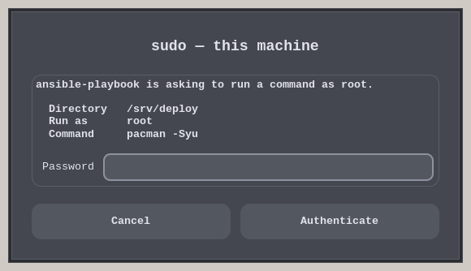
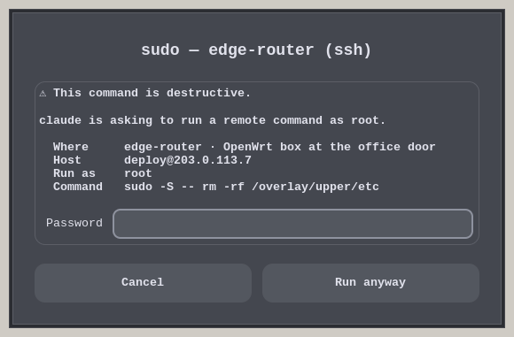

# askpass

A sudo password dialog that tells you what you are approving.

It exists so that a program — an agent, a deploy script, a job runner — can use
`sudo` without ever being told your password, and without you losing sight of
what it runs as root.

**Linux only.** It reads `/proc`, talks to zenity or `systemd-ask-password`, and
logs to the journal. None of that exists elsewhere.





## The problem

`SUDO_ASKPASS` is a standard sudo feature: point it at a program, run `sudo -A`,
and sudo asks that program for the password instead of using the terminal. It
has one flaw. sudo hands the helper a single string — the prompt — and nothing
else. Not the command, not the target user, not the directory. So every askpass
dialog ever written says "Password:" and leaves you to guess.

If a script, a CI wrapper, or an agent is driving sudo on your behalf, you are
typing your password blind.

This helper works the rest out on its own.

## Why you might want it

The case it was built for: giving a program the ability to run `sudo` while
keeping both the password and the decision on your side.

With `SUDO_ASKPASS` pointed here:

* **The password never reaches the caller.** It travels from the dialog into
  sudo. The program that ran `sudo -A` gets an exit status and nothing else, so
  it cannot store the secret, print it, or carry it into a log, a transcript or
  a bug report.
* **Every escalation stops at a dialog** naming the command, the target user,
  the directory, and — over ssh — the machine. Nothing runs as root that you did
  not have the chance to read first.
* **Refusal is per command.** Saying no once revokes nothing and breaks nothing;
  the caller gets a distinct "declined" and carries on.
* **There is a record afterwards.** Each request lands in the journal with its
  outcome, so "what did it do as root today" has an answer.

Compare that with the usual alternatives: a `NOPASSWD` line in sudoers, which
removes the prompt entirely; the password in an environment variable or a config
file, where the caller now keeps it forever; or simply running the whole thing
as root. Against those three, a dialog you have to read is a real improvement.

It is, of course, still a dialog you have to read — see
[What this is not](#what-this-is-not).

## How it knows

* **Locally** it walks up `/proc` from its own process until it finds the `sudo`
  that spawned it, then reads that process's command line and target user. The
  working directory comes from sudo's parent, because sudo is setuid root and
  its own `cwd` link is unreadable. Nothing is required from the caller.
* **Who is asking** is the first ancestor that is not a shell or a wrapper, so
  the dialog says `ansible-playbook is asking…` rather than the useless
  `zsh is asking…`.
* **Over ssh** the bundled MCP server passes a JSON context in `ASKPASS_CONTEXT`,
  which lets the dialog name the server, its description, the login and the
  exact remote command.
* If neither works, it shows the original prompt, exactly like any other helper.

## Requirements

| | |
|---|---|
| OS | Linux — `/proc` and the systemd journal |
| Python | 3.10 or newer, standard library only |
| Dialog | `zenity` for the graphical prompt |
| Fallbacks | `systemd-ask-password`, then a tty read |
| Logging | `systemd-cat`, optional — its absence is not an error |

Developed on Arch with Hyprland (Wayland); GTK picks X11 or Wayland by itself
and the dialog works the same either way.

## Install

```sh
git clone https://github.com/SilentAutomaton/askpass ~/askpass
chmod +x ~/askpass/askpass
echo 'export SUDO_ASKPASS=$HOME/askpass/askpass' >> ~/.profile
```

Then, in a new shell:

```sh
sudo -A id
```

You should get a dialog naming the program that called sudo, the directory and
`id`.

`askpass --demo` renders both dialogs with sample data, which is a quicker way
to see what they look like.

## Running sudo on a remote host

The [`mcp/`](mcp/) directory holds an MCP server with one tool,
`ssh_sudo_exec`: it runs a single command under sudo on a remote host, asks for
the password locally through this helper, and feeds it to the remote `sudo -S`
over stdin. The password is never an argument and never an environment variable.

```sh
cd mcp && npm install
```

```json
{
  "mcpServers": {
    "sudo-ssh": {
      "type": "stdio",
      "command": "node",
      "args": ["/path/to/askpass/mcp/index.js"],
      "env": {
        "SUDO_ASKPASS": "/path/to/askpass/askpass",
        "SSH_MANAGER_ENV": "/path/to/servers.env"
      }
    }
  }
}
```

Servers are read from an env file whose format matches
[mcp-ssh-manager](https://www.npmjs.com/package/mcp-ssh-manager), so an existing
one can be reused as is. `SSH_MANAGER_ENV` may point anywhere; the default is
`~/.ssh-manager/.env`.

| Key | Meaning |
|---|---|
| `SSH_SERVER_<NAME>_HOST` | hostname or address |
| `SSH_SERVER_<NAME>_USER` | ssh login |
| `SSH_SERVER_<NAME>_PORT` | port, defaults to 22 |
| `SSH_SERVER_<NAME>_KEYPATH` | private key, optional |
| `SSH_SERVER_<NAME>_DESCRIPTION` | shown in the dialog, optional but worth filling in |

`node mcp/index.js --check` prints the helper it will use and the servers it can
see. The host is checked for a listening ssh port before the dialog opens, so a
machine that is down costs you an error after ten seconds instead of a password
prompt.

## Exit codes

| Code | Meaning |
|---|---|
| 0 | password on stdout |
| 1 | the person cancelled |
| 5 | the dialog timed out — 300 s, `ASKPASS_TIMEOUT` overrides |
| 2 | no display, no `systemd-ask-password`, no tty — nowhere to ask |

Callers can tell these apart, which beats the usual "askpass failed".

## What gets logged

One line per request, under the `askpass` tag:

```console
$ journalctl -t askpass -n 2 -o cat
outcome=ok kind=local caller=claude run_as=root cwd=/srv/deploy command=pacman -Syu
outcome=declined kind=ssh caller=claude server=edge-router login=deploy run_as=root command=sudo -S -- systemctl restart nginx
```

The password is not part of the context those lines are built from, so it cannot
end up there.

## What this is not

This is a transparency tool, not an access control tool.

It makes the dialog honest in a setup where some program already runs sudo. It
does **not** make such a setup safe, and it is not a sandbox, a policy engine, or
an audit trail you could lean on. If you let automation run commands as root,
you own that decision; this only gives you a fair chance of seeing what is about
to happen before you type your password.

The destructive-command banner is a hint for the eye. The pattern list is short
and deliberately readable, and plenty slips past it — `bash -c '…'`, a script
with an innocent name, a command long enough that nobody reads to the end. Treat
a missing banner as "no opinion", never as "safe".

Escaping is handled where it matters: the dialog text is Pango markup, and
anything taken from a command line is escaped before it gets there.

## Development

```sh
python3 test/test_context.py   # parsing, escaping, danger patterns, caller
python3 askpass --demo         # both dialogs, sample data
node mcp/index.js --check      # helper path and visible servers
```

The screenshots above are rendered inside a disposable Xvfb desktop, so they
contain no real hosts.

## Licence

MIT.
